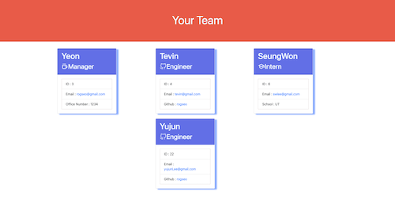
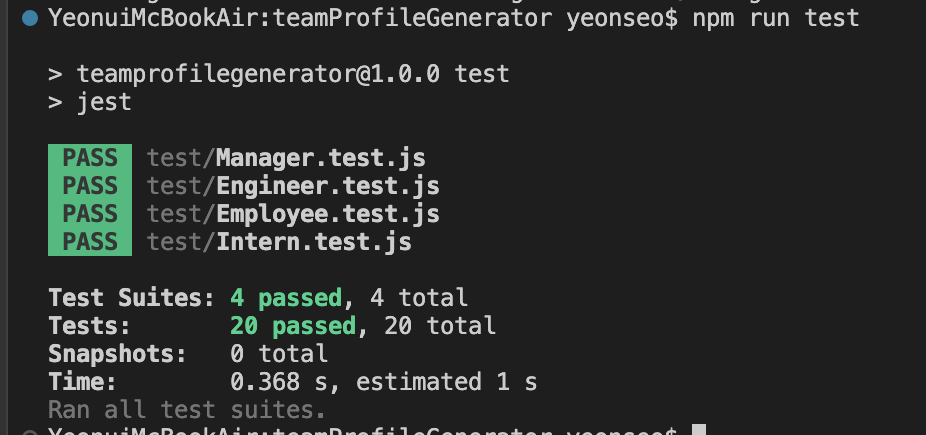

# teamProfileGenerator

[](https://opensource.org/licenses/MIT)

A command-line application that takes in information about employees on a certain team, then generates an HTML webpage that displays summaries for each person.


## Technology
[Jest](https://www.npmjs.com/package/jest) for running the unit tests and [Inquirer](https://www.npmjs.com/package/inquirer/v/8.2.4) for collecting input from the user.


## Table of Contents
- [Installation](#installation)
- [Usage](#usage)
- [Tests](#tests)
- [Demonstration](#demonstration)
- [Improvement](#improvement)
- [Credit](#credit)
- [Questions](#questions)

## Installation
Install jest and inquirer by using the following command:
```bash
node install
```
Check package.json to see what has been installed
```
 "dependencies": {
    "inquirer": "^8.2.4",
    "jest": "^29.2.1",
    "reset": "^0.1.0"
  }
```

## Usage

The application will start by using the following command:
```bash
node index.js
```
Application Flow
```
WHEN I start the application
THEN I am prompted to enter the team manager’s name, employee ID, email address, and office number
WHEN I enter the team manager’s name, employee ID, email address, and office number
THEN I am presented with a menu with the option to add an engineer or an intern or to finish building my team
WHEN I select the engineer option
THEN I am prompted to enter the engineer’s name, ID, email, and GitHub username, and I am taken back to the menu
WHEN I select the intern option
THEN I am prompted to enter the intern’s name, ID, email, and school, and I am taken back to the menu
WHEN I decide to finish building my team
THEN I exit the application, and the HTML is generated in 'dist' folder.
```
View the generated folder in browser.



## Tests

After Install jest, run the following command.
```bash
npm run test
```




## Demonstration
[ViewDemoVideo](https://watch.screencastify.com/v/5KPWM4vYaMBR2lqgYyp6)

## Improvement
Add github Id validation by using github API.

## Credit
Icon : https://iconify.design/

## Questions
if you have more question, reach me out below.
* Github repository : https://github.com/rogseo
* email : rogseo@gmail.com
